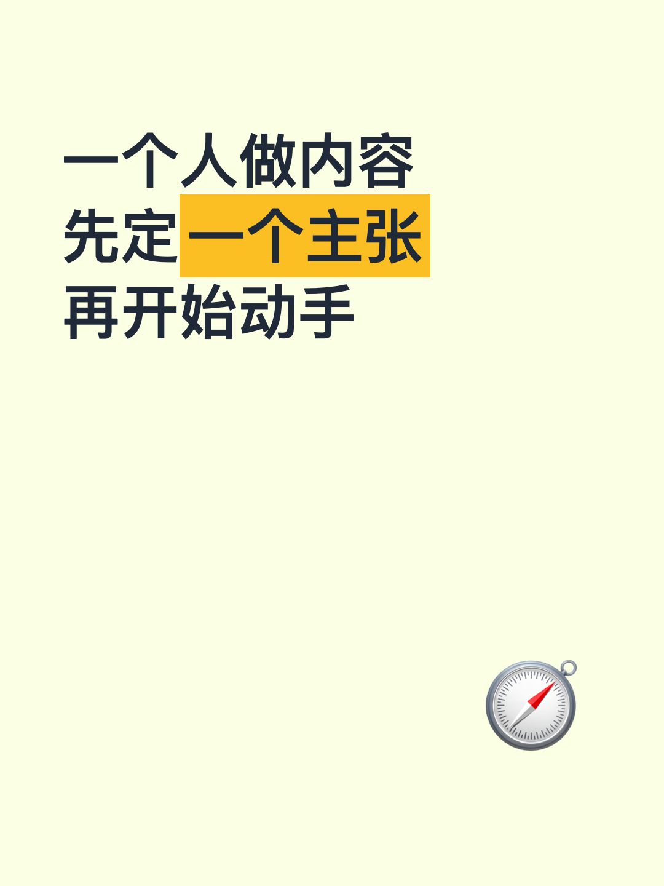
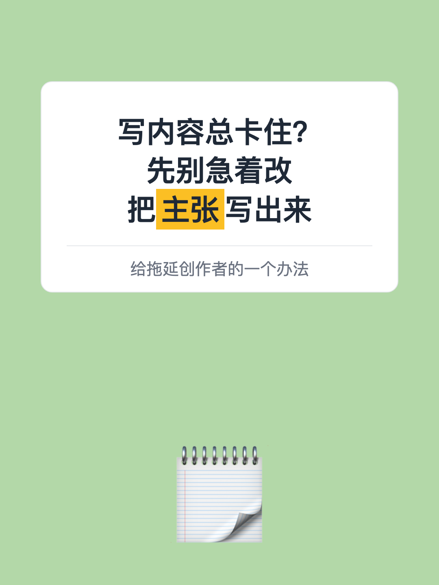
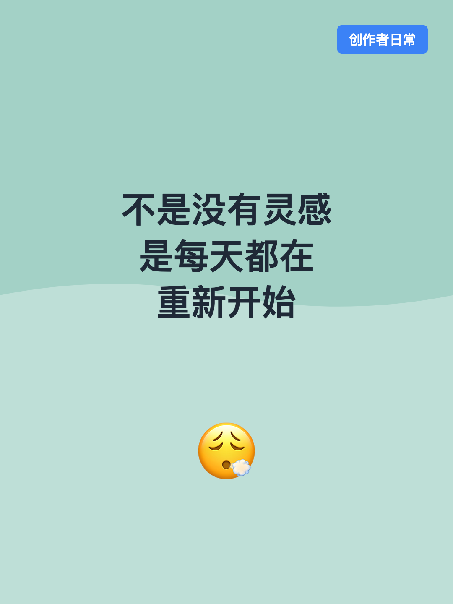
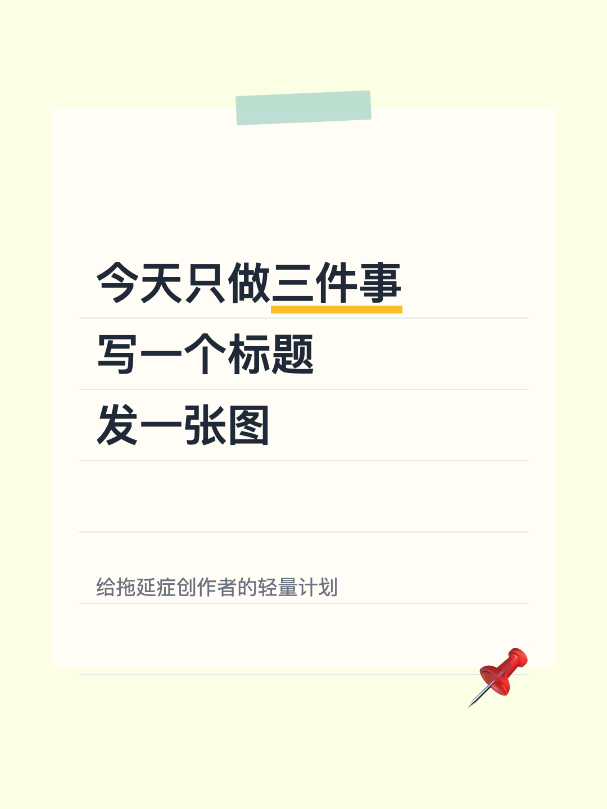
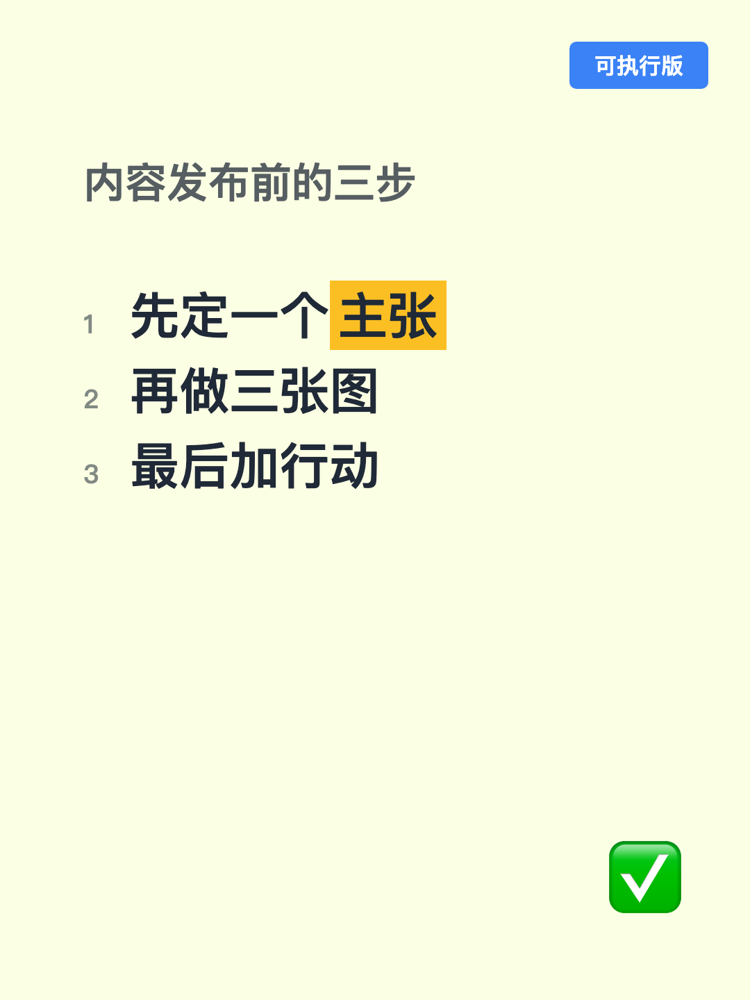
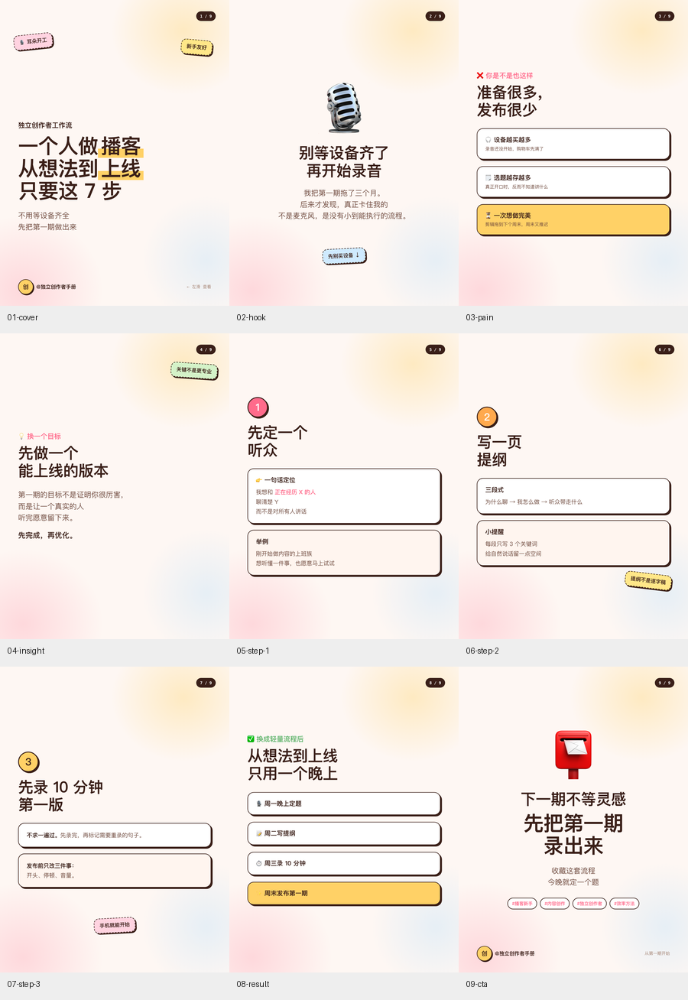

# xhs-cover-generator

一个本地运行的小红书封面与图文生成器。输入标题、文案或一个 JSON 文件，使用 HTML/CSS 和本地 Chrome 渲染为 `1080×1440` PNG。

支持两种模式：

- 单张封面：6 个内置版式、4 套配色、自定义模板
- 多页图文 deck：一份 JSON 生成任意页数的轮播图，内置 `deck-xhs-post` 9 页示例

## 模板预览

以下预览使用每个模板自带的示例文案，统一使用 `melon` 配色。换用其他配色不会改变版式。

<table>
  <tr>
    <td align="center"><br><sub>思考型</sub></td>
    <td align="center"><br><sub>对话框型</sub></td>
    <td align="center"><br><sub>情绪型</sub></td>
  </tr>
  <tr>
    <td align="center"><br><sub>引用型</sub></td>
    <td align="center"><br><sub>便签型</sub></td>
    <td align="center"><br><sub>清单型</sub></td>
  </tr>
</table>

模板选择建议：思考型适合教程和方法论，对话框型适合问答和避坑，情绪型适合情感表达，引用型适合金句和书摘，便签型适合日常清单，清单型适合多条方法或工具合集。
模板使用稳定的 key，不依赖列表位置。可用 key 是 `thinking`、`dialog`、`emotion`、`quote`、`note` 和 `list`。

## 多页图文预览：`deck-xhs-post`

`deck-xhs-post` 是独立于单张封面模板的多页图文模式。内置示例包含完整 9 页：封面、开场、痛点、洞察、3 个步骤、结果和 CTA。

<p align="center">
  
</p>

逐页 PNG 保存在 [assets/previews/deck-xhs-post-pages](assets/previews/deck-xhs-post-pages/)：

- [01 cover](assets/previews/deck-xhs-post-pages/01-cover.png)
- [02 hook](assets/previews/deck-xhs-post-pages/02-hook.png)
- [03 pain](assets/previews/deck-xhs-post-pages/03-pain.png)
- [04 insight](assets/previews/deck-xhs-post-pages/04-insight.png)
- [05 step-1](assets/previews/deck-xhs-post-pages/05-step-1.png)
- [06 step-2](assets/previews/deck-xhs-post-pages/06-step-2.png)
- [07 step-3](assets/previews/deck-xhs-post-pages/07-step-3.png)
- [08 result](assets/previews/deck-xhs-post-pages/08-result.png)
- [09 cta](assets/previews/deck-xhs-post-pages/09-cta.png)

## 快速开始

需要 Node.js，以及 Chrome、Chromium 或 Edge。脚本会自动寻找浏览器，不需要安装 npm 依赖。

```bash
git clone <your-repository-url>
cd xhs-cover-generator
```

### 生成一张封面

```bash
node scripts/make-cover.mjs \
  --template thinking \
  --theme braun \
  --main "5个AI工具\n让工作效率翻倍" \
  --highlight "AI工具" \
  --tag "实测有效" \
  --emoji "⚡" \
  --out out/cover.png
```

模板参数使用稳定的 key，例如 `--template thinking`。查看完整模板和配色表：

```bash
node scripts/make-cover.mjs --list
```

不传文案时，会渲染对应模板的内置示例：

```bash
node scripts/make-cover.mjs --template thinking --out out/thinking.png
```

### 生成整套多页图文

直接生成内置的原版风格 9 页示例：

```bash
node scripts/make-deck.mjs --sample --outdir out/deck
```

使用自己的 deck JSON：

```bash
node scripts/make-deck.mjs \
  --deck my-deck.json \
  --outdir out/deck \
  --theme mint
```

建议先输出 HTML 检查文案是否适合画布，再渲染 PNG：

```bash
node scripts/make-deck.mjs --deck my-deck.json --html out/deck-preview.html
node scripts/make-deck.mjs --deck my-deck.json --page 1 --out out/cover.png
```

HTML 预览会把每页固定在 `3:4` 画布中并响应式缩放。打开后可以点击“导出本页 PNG”或“导出全部 PNG”；导出尺寸使用 deck 的 `width` 和 `height`，默认是 `1080×1440`。

deck 支持 `title`、`eyebrow`、`text`、`emoji`、`badge`、`cards`、`box`、`tags` 和 `space` 块，也支持贴纸、作者栏和页码。文字支持 `==高亮==`、`**加粗**`、`[[强调色]]` 和 `\n` 换行。

完整示例：[assets/deck-xhs-post.sample.json](assets/deck-xhs-post.sample.json)。字段说明：[references/deck-schema.md](references/deck-schema.md)。

### 自定义模板

模板使用 JSON 定义，不需要修改渲染代码：

```bash
node scripts/make-cover.mjs \
  --template-file assets/custom-template.example.json \
  --template poster \
  --main "我的自定义模板" \
  --out out/custom.png
```

自定义模板可以组合 `plain`、`card`、`frame`、`paper` 和 `band` 结构，并设置装饰、高亮方式、角标位置和文字区域。详细字段见 [references/design-system.md](references/design-system.md)。

### 本地编辑器

需要手动调整封面时，可以启动编辑器：

```bash
node scripts/make-cover.mjs --editor --port 5178
```

然后打开 `http://localhost:5178`，可以实时修改文案、模板、配色和 emoji 位置，并保存 PNG。

## 配色

单张封面支持：`braun`、`melon`、`sunset`、`ocean`。

多页 deck 支持：`peach`、`mint`、`lilac`、`butter`。

也可以通过 `XHS_COVER_CHROME` 指定浏览器可执行文件路径：

```bash
XHS_COVER_CHROME=/path/to/chrome node scripts/make-cover.mjs --template thinking
```

## 项目结构

```text
xhs-cover-generator/
├── SKILL.md
├── README.md
├── agents/openai.yaml
├── assets/
│   ├── previews/
│   │   ├── thinking.png dialog.png emotion.png quote.png note.png list.png
│   │   ├── deck-xhs-post-overview.png
│   │   └── deck-xhs-post-pages/
│   ├── custom-template.example.json
│   └── deck-xhs-post.sample.json
├── references/
└── scripts/
```

## 说明

这是一个文字驱动的本地渲染器，适合封面、知识卡片和轮播图排版；它不负责照片生成或 AI 插画生成。
